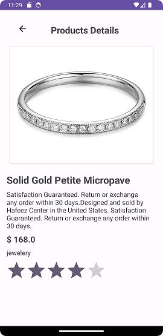

# Android Project: MVVM Demo

## Description:
This Android project demonstrates how to implement API calling using Retrofit, display data in a RecyclerView.

## Features:
- **API Calling:** Utilizes Retrofit library for making API calls to retrieve data.
- **RecyclerView:** Displays the data in a scrollable list using RecyclerView.

## Requirements:
- Android Studio (version 4.0+)
- Minimum SDK version: Android 7.0 (API level 24)
- Internet permission in AndroidManifest.xml

## Installation:
1. Clone this repository to your local machine using the following command:

2. Open the project in Android Studio.
3. Build and run the project on your Android device or emulator.

## Usage:
1. Launch the application on your device or emulator.
2. Explore the data displayed in the RecyclerView.
3. Details screen of the list

## API Documentation:
- **API Endpoint:** `https://fakestoreapi.com/products`
- **Request Method:** GET

## Dependencies:
- Retrofit: [2.9.0]
- RecyclerView: [1.3.2]

## ScreenShots:

